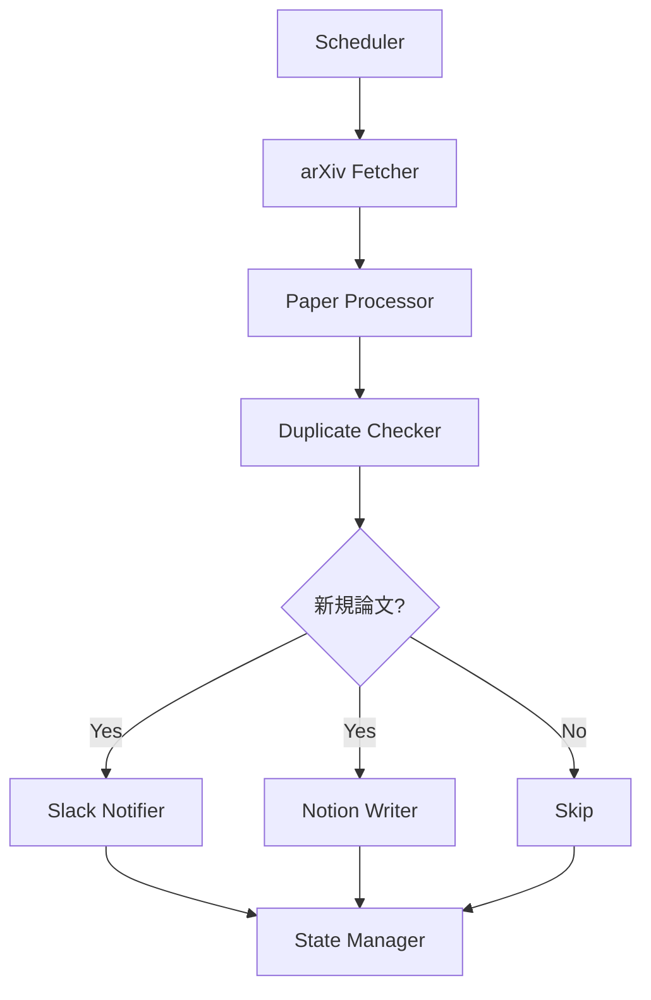

# arXiv論文自動収集・通知システム 設計書

## 1. 要件定義書

### 1.1 業務要件

#### 機能要件
- arXivから指定したキーワードに基づいて最新の論文を定期的に取得する
- 取得した論文情報をSlackの特定チャネルに投稿する
- 取得した論文情報をNotionデータベースに自動追加する
- 重複投稿を防ぐ仕組みを実装する
- 設定ファイルでキーワードや実行間隔を管理できる

#### 非機能要件
- 24時間365日の安定稼働を実現する
- エラー発生時の自動リトライ機能を実装する
- ログ出力により運用状況を監視可能にする
- 外部APIの利用制限を考慮した実装を行う

### 1.2 データ要件

#### 管理対象データ
- 論文情報（タイトル、著者、要約、URL、カテゴリ、投稿日時）
- 処理済み論文のID（重複防止用）
- 実行履歴（成功/失敗、処理件数、エラー内容）

## 2. 設計書

### 2.1 システム概要



### 2.2 機能設計

#### 主要機能
1. **論文取得機能**
   - arXiv APIを使用して論文を検索
   - キーワード、カテゴリ、日付範囲での絞り込み
   - ページネーション対応

2. **Slack通知機能**
   - Webhook URLを使用した投稿
   - 論文情報の整形（タイトル、著者、要約、リンク）
   - スレッド形式での連続投稿対応

3. **Notion連携機能**
   - Notion APIを使用したデータベース操作
   - 論文情報の構造化保存
   - タグ付けとカテゴリ分類

4. **重複管理機能**
   - SQLiteデータベースでの処理済みID管理
   - 定期的な古いデータのクリーンアップ

5. **スケジューリング機能**
   - cronライクな定期実行
   - 実行間隔の設定可能

### 2.3 クラス構成

```python
# src/arxiv_notifier/
├── __init__.py
├── config.py          # 設定管理
├── models.py          # データモデル定義
├── arxiv_client.py    # arXiv API クライアント
├── slack_client.py    # Slack通知クライアント
├── notion_client.py   # Notion APIクライアント
├── database.py        # SQLiteデータベース管理
├── processor.py       # メイン処理ロジック
├── scheduler.py       # スケジューラー
└── main.py           # エントリーポイント
```

### 2.4 データモデル

#### Paper（論文情報）
```python
class Paper:
    id: str                    # arXiv ID
    title: str                 # 論文タイトル
    authors: List[str]         # 著者リスト
    abstract: str              # 要約
    categories: List[str]      # カテゴリ
    published_date: datetime   # 公開日
    updated_date: datetime     # 更新日
    pdf_url: str              # PDFリンク
    arxiv_url: str            # arXivページリンク
```

#### ProcessedPaper（処理済み論文）
```python
class ProcessedPaper:
    arxiv_id: str             # arXiv ID
    processed_at: datetime    # 処理日時
    slack_posted: bool        # Slack投稿済みフラグ
    notion_added: bool        # Notion追加済みフラグ
```

### 2.5 API設計

#### 外部API利用
1. **arXiv API**
   - エンドポイント: `http://export.arxiv.org/api/query`
   - レート制限: 3秒間隔でのリクエスト推奨

2. **Slack Webhook API**
   - カスタムWebhook URLを使用
   - レート制限: 1秒に1メッセージ

3. **Notion API**
   - 認証: Integration Token
   - レート制限: 3リクエスト/秒

## 3. セキュリティ考慮事項

### 3.1 アクセス制御
- 環境変数での認証情報管理（.envファイル使用）
- Slack Webhook URLの秘匿化
- Notion Integration Tokenの安全な管理

### 3.2 データ保護
- SQLiteデータベースファイルのアクセス権限設定
- ログファイルに認証情報を出力しない
- HTTPSでの通信を強制

### 3.3 依存ライブラリの管理
- 定期的な脆弱性スキャン
- 最小限の依存関係維持
- バージョン固定による安定性確保

## 4. 運用設計

### 4.1 ログ設計
- ログレベル: DEBUG, INFO, WARNING, ERROR, CRITICAL
- ローテーション: 日次、最大30日保持
- 出力先: ファイル（logs/arxiv_notifier.log）

### 4.2 監視項目
- 処理成功/失敗数
- API応答時間
- エラー発生率
- 処理論文数の推移

### 4.3 エラーハンドリング
- API接続エラー: 指数バックオフでリトライ（最大3回）
- 認証エラー: 即座に管理者通知
- データ不整合: トランザクション管理でロールバック

### 4.4 リカバリ方針
- 処理中断時: 最後の成功地点から再開
- データベース破損: 定期バックアップから復元
- 設定ミス: バリデーションによる事前検知

## 5. 実装計画

### フェーズ1: 基本機能実装
1. 設定管理とデータモデル定義
2. arXiv APIクライアント実装
3. SQLiteデータベース管理機能

### フェーズ2: 通知機能実装
1. Slack通知機能
2. Notion連携機能
3. 重複チェック機能

### フェーズ3: 運用機能実装
1. スケジューラー実装
2. ログ・監視機能
3. エラーハンドリング強化

### フェーズ4: テスト・最適化
1. ユニットテスト作成
2. 統合テスト実装
3. パフォーマンス最適化

## 6. 使用技術スタック

- Python 3.11+
- ライブラリ:
  - httpx: 非同期HTTPクライアント
  - pydantic: データバリデーション
  - sqlalchemy: ORM
  - schedule: スケジューリング
  - python-dotenv: 環境変数管理
  - loguru: ログ管理
  - pytest: テストフレームワーク
